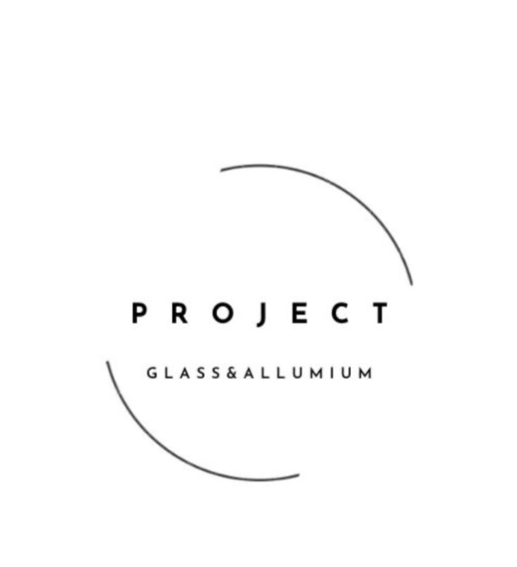
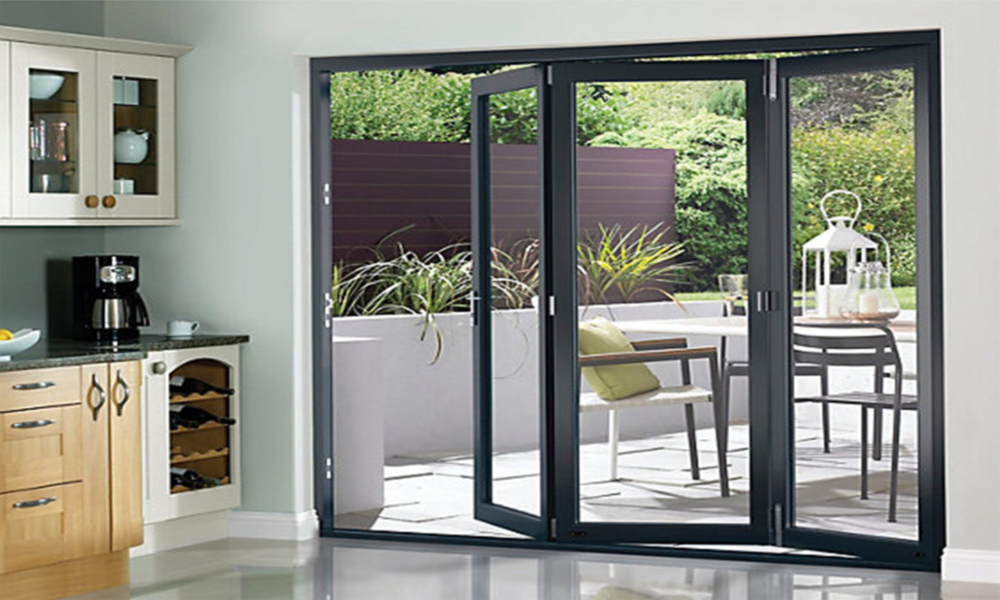
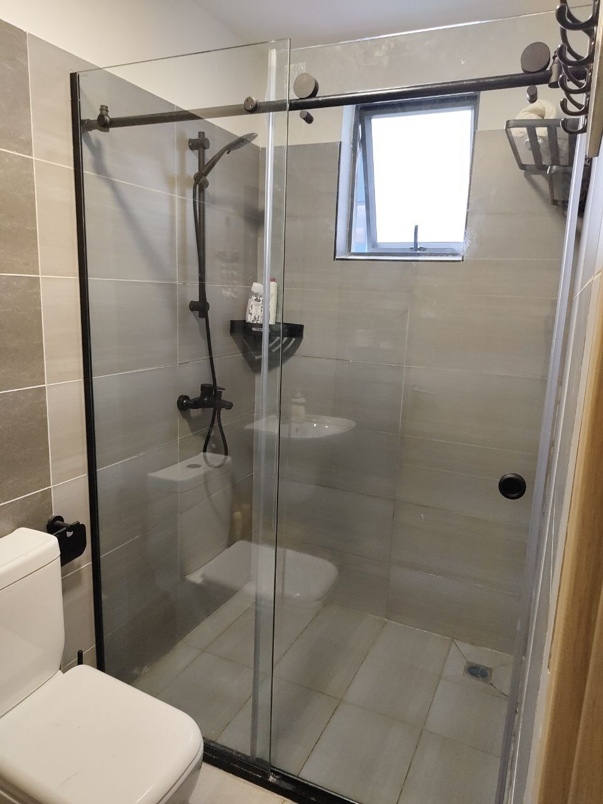
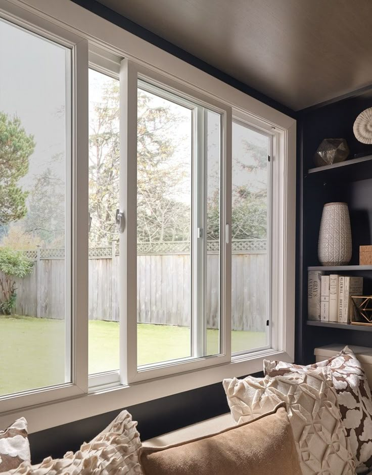
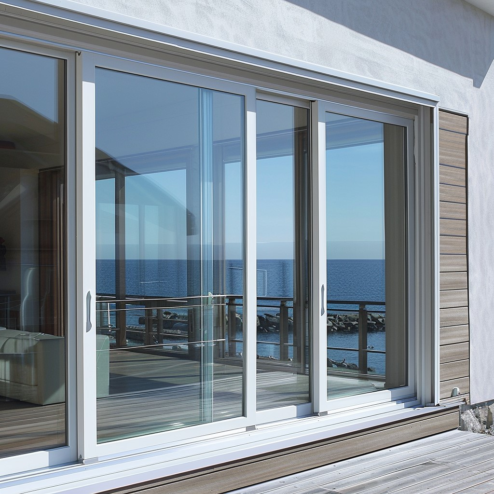

<!DOCTYPE html>
<html lang="en">
<head>
    <meta charset="UTF-8">
    <meta name="viewport" content="width=device-width, initial-scale=1.0">
    <title>Project Glass & Aluminium | Mariakani</title>
    <link href="https://fonts.googleapis.com/css2?family=Montserrat:wght@300;600&display=swap" rel="stylesheet">
    <link rel="stylesheet" href="https://cdnjs.cloudflare.com/ajax/libs/font-awesome/6.0.0/css/all.min.css">
    
</head>
<body>

    <nav>
        
        
Project

    </nav>

    <section class="portfolio">
        <h2 class="section-title">Recent Work</h2>
        

            

Aluminium Folding Doors

            

Frameless Shower Cubicle

            

Sliding Windows

            

Premium Sliding Doors

        

    </section>

    <section class="reviews">
        <h2 class="section-title">Client Feedback</h2>
        

            
"High quality aluminium work! My sliding windows look amazing and were installed perfectly."

            
- Happy Client, Mariakani

        

        

            
"Very professional service. The frameless shower cubicle changed my whole bathroom vibe."

            
- Local Business Owner

        

    </section>

    <section class="location">
        <h2 class="section-title">Find Us</h2>
        

            <i class="fas fa-map-marker-alt" style="font-size: 2rem; margin-bottom: 1rem;"></i>
            <h3>Mariakani Shop</h3>
            
Kaloleni Highway, Near Timbers Hardware

            <a href="https://www.google.com/maps/search/?api=1&query=Timbers+Hardware+Mariakani+Kaloleni+Highway" target="_blank" class="map-btn">
                <i class="fas fa-directions"></i> Get Directions
            </a>
        

    </section>

    

        <a href="tel:0719488872" class="btn-float phone"><i class="fas fa-phone"></i></a>
        <a href="https://api.whatsapp.com/send?phone=254719488872" class="btn-float whatsapp"><i class="fab fa-whatsapp"></i></a>
    

    <footer>&copy; 2026 Project Glass & Aluminium</footer>

</body>
</html>
